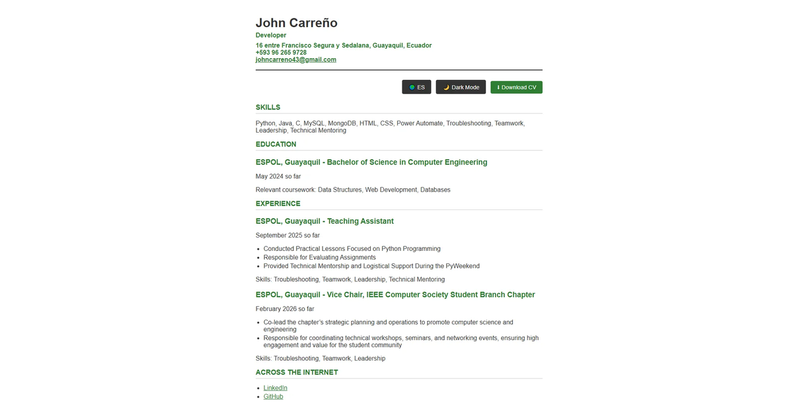

# Single-Page CV — John Carreño

A single-page curriculum vitae built with semantic HTML and CSS, deployed on GitHub Pages.

🌐 **Live site:** [john0487.github.io/cv-project](https://john0487.github.io/cv-project)



## About the Project

This project is a personal CV webpage built from scratch using only HTML and CSS. The goal was to create a well-structured, accessible, and SEO-friendly page that could serve as a real online resume.

## Features

- Semantic HTML5 structure (`header`, `main`, `section`, `article`, `address`)
- SEO meta tags for better search engine visibility
- Open Graph tags for rich social media sharing
- Responsive design that adapts to mobile and desktop screens
- Dark mode toggle
- Language toggle between English and Spanish
- Downloadable PDF version
- Favicon linked in the head section

## Technologies Used

- HTML5
- CSS3
- JavaScript (vanilla)

## What I Learned

- How to structure a webpage using semantic HTML tags
- How SEO and Open Graph meta tags work
- How to write responsive CSS using media queries
- How to manipulate the DOM with vanilla JavaScript
- How to deploy a static site using GitHub Pages
- Version control with Git and GitHub

## Running Locally

```bash
git clone https://github.com/John0487/cv-project.git
cd cv-project
```

Then open `index.html` with Live Server in VS Code.

## Inspiration

This project was built as part of the [roadmap.sh](https://roadmap.sh) frontend learning path.

Project reference: [Single-Page CV — roadmap.sh](https://roadmap.sh/projects/single-page-cv)